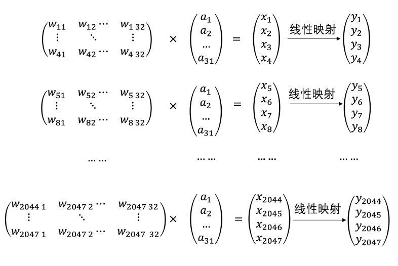
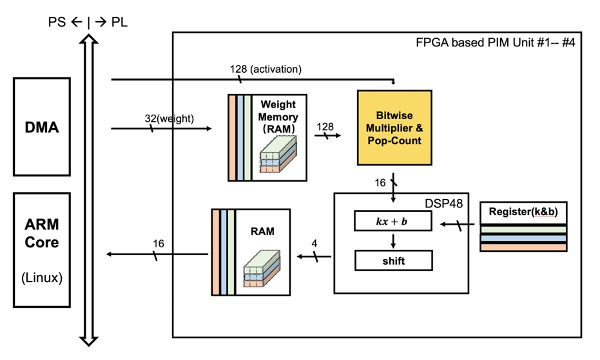
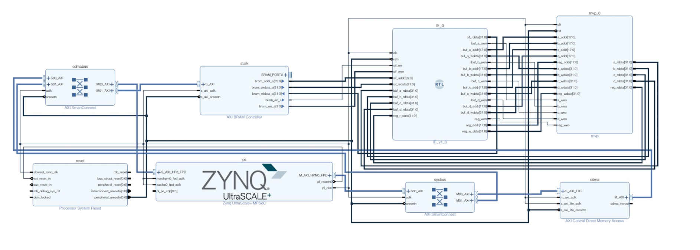
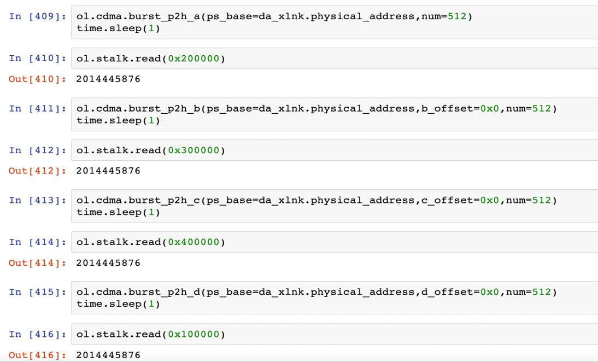

# MVP:Matrix-vector multiplication implemented on PYNQ board
# Introduction

There are a huge number of ***Matrix-Vector Multiplication***  operations in deep learning.This work is aimed at building a general module that can support different forms of neural network. 

Both activation and weight are quantified into **4 bit** (the MSB is the signal bit) with Learned step-size qunatization(LSQ) algorithm.

A bit serial method is adopted to complete the MAC operation and it can greatly reduce power consumption compared to tradtional method.

# Architecture

Note that DMA is used to move weigth and activation.
Of course you can also use .coe to load the data into BRAM.
 
# Block Design 

# Software Implementation  
      
More at *./notebook/mvp.py*  

# Acknowledgment 

This work is based on the work of @zhuiyuanjiao and @zhutmost.
